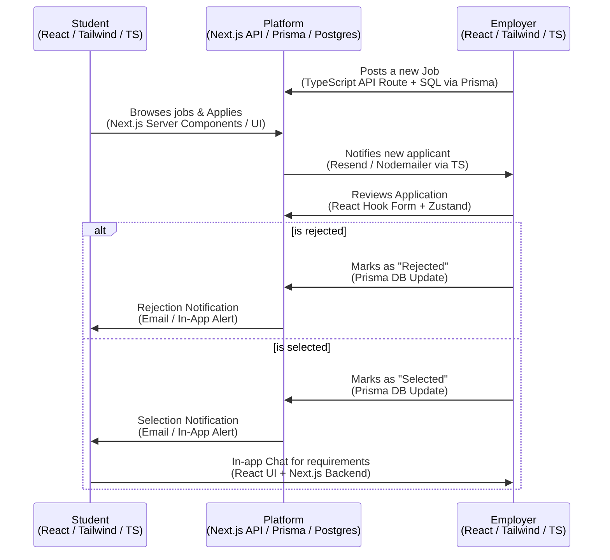

# StudentConnect: End-to-End Project Architecture & Workflows

Here is an end-to-end overview of the StudentConnect project architecture, workflows, and the technology stack we are using based on the codebase structure.

## 1. What is StudentConnect?
StudentConnect is a comprehensive platform connecting students with skill-based part-time jobs. Based on the app's routing structure (`/app`), the application serves multiple distinct user roles:

*   **Student Portal (`/app/student`)**: Where students can browse jobs, manage applications, and update their profiles.
*   **Employer Portal (`/app/employer`)**: Where employers can post jobs, review student applications, and manage hiring.
*   **Admin Dashboard (`/app/admin`)**: A centralized dashboard for platform administrators to monitor activity, manage users, and handle settings.
*   **Agent Portal (`/app/agent`)**: Likely a specialized role for third-party agents or campus ambassadors to manage activities.

## 2. Technology Stack & Languages
The entire application is built using a modern JavaScript/TypeScript ecosystem, allowing for a unified full-stack architecture within a single codebase.

### Primary Languages:
*   **TypeScript (`.ts`, `.tsx`)**: The core language used across the entire frontend and backend. It provides static typing for better developer experience and fewer runtime errors.
*   **JavaScript (`.js`)**: Used for some testing scripts, database application scripts, and configuration files.
*   **SQL (`schema.sql`)**: Used for raw database schemas and migrations.
*   **CSS / Tailwind (`globals.css`)**: Used for styling the application.

### Frontend Architecture
*   **Framework**: Next.js 16 (App Router) – Handles routing, server-side rendering (SSR), and static site generation.
*   **UI Library**: React 19.
*   **Styling**: Tailwind CSS v4 combined with Radix UI primitives for accessible, unstyled components.
*   **Animations**: Framer Motion for smooth, dynamic UI transitions.
*   **State Management**: Zustand for global state and React Hook Form for form handling.
*   **Icons**: Lucide React.
*   **PWA**: `@ducanh2912/next-pwa` is configured, meaning the app can be installed as a Progressive Web App on mobile and desktop.

### Backend Architecture
*   **Framework**: Next.js API Routes (`/app/api`) – The backend logic lives in the same repository as the frontend, exposed as RESTful API endpoints.
*   **Database**: PostgreSQL.
*   **ORM (Object-Relational Mapping)**: Prisma (`@prisma/client`) is used to interact with the PostgreSQL database securely and with full TypeScript support.
*   **Authentication**: A combination of NextAuth.js (v5 Beta) and Supabase. JWTs and bcryptjs are also utilized for secure credential handling.
*   **Payments**: Stripe API for handling employer subscriptions or payment processing.
*   **Emails/Notifications**: Resend and Nodemailer to send transactional emails (e.g., OTPs, job application updates).

### Testing & Quality Assurance
*   **E2E Web Testing**: Playwright and Selenium WebDriver.
*   **Mobile Testing**: WebdriverIO / Appium.
*   **Unit/Integration**: Mocha and Chai.

## 3. Core Architecture & Workflows
Because this is a Next.js App Router project, the architecture follows a Serverless Full-Stack model:

*   **Client-Server Interaction**:
    *   The frontend utilizes Next.js React Server Components (RSC) to fetch data directly on the server, resulting in faster load times and better SEO.
    *   Interactive client components (e.g., forms, buttons) interact with our backend via Next.js Route Handlers (`/app/api/...`).
*   **Database Workflow**:
    *   When an API route needs data, it calls Prisma.
    *   Prisma translates the TypeScript query into highly optimized SQL, talks to the PostgreSQL database (potentially hosted on Supabase), and returns the heavily typed data back to the frontend.
*   **Authentication Flow**:
    *   Users navigate to `/login` or `/register`.
    *   Credentials or OAuth providers are processed by NextAuth/Supabase.
    *   Session cookies/tokens are securely stored. Middleware protects routes like `/app/employer` and `/app/admin` to ensure only authorized users access them.
*   **AI/LLM Integration**:
    *   The project includes `@google/genai`, indicating there is an AI component—likely used for generating job descriptions, matching students to jobs, or chat features.

In short, StudentConnect is a unified TypeScript Next.js application that leverages serverless architecture, a Postgres/Prisma database layer, and a highly interactive React/Tailwind frontend.

## 4. Platform Workflow Map (Tech Stack Annotated)

Below is the core application workflow (matching your diagram) annotated with the specific technologies, languages, and frameworks used at each step of the process.

